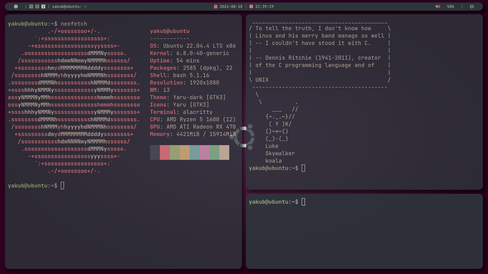

# Dotfiles



## Getting started:
### 0. Requirements:
Before going any further, make sure you have all the prerequesites installed on your system. Check-out [Package List](#package-list) and [Fonts](#fonts) for required dependencies. For required packages, follow the installation-steps given by their maintainers.
Also, please note that this dotfiles were created for `Ubuntu 22.04 LTS` version. There's a possibility of breaking on other machines.

### 1. Getting started:
- Clone this repository:
```console
$ git clone --recurse-submodules https://github.com/itsYakub/Dotfiles.git
```
- Enter the repository:
```console
$ cd Dotfiles
```
- Execute the `setup.sh` script:
```console
$ ./setup.sh
```
`setup.sh` is a special bash-script that basically creates a symbolic link to directories from this repository to the correct locations on your hard-drive. The main destinations is `.config` directory.

*WARNING: If there're existing config directories for things that're gonna be modified by this command, previous directories'll be moved to the directory prefixed with the `_` character. Then there'll be symbolic links created.*

- If you want to undo your changes, simply run the `undo.sh` script:
```console
$ ./undo.sh
```

*WARNING: This will only work if the previous directories (those with the `_` prefix) weren't modified, deleted or renamed*

## Package list:
- Desktop Environment: [i3-gaps](https://github.com/Airblader/i3)
- Bar: [polybar](https://github.com/polybar/polybar)
- Compositor: [picom](https://github.com/yshui/picom)
- Terminal emulator: [alacritty](https://github.com/alacritty/alacritty)
- Shell: bash
- Menu: [rofi](https://github.com/davatorium/rofi.git)
- Wallpaper set-up: [feh](https://github.com/derf/feh.git)
- Screenshooting: [maim](https://github.com/naelstrof/maim)

## Fonts:
- [JetBrains Mono](https://www.jetbrains.com/lp/mono/)
- [FontAwesome](https://fontawesome.com/)
- [Nerd Fonts](https://www.nerdfonts.com/)